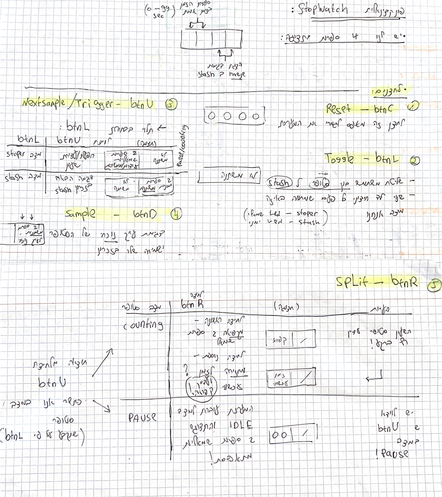
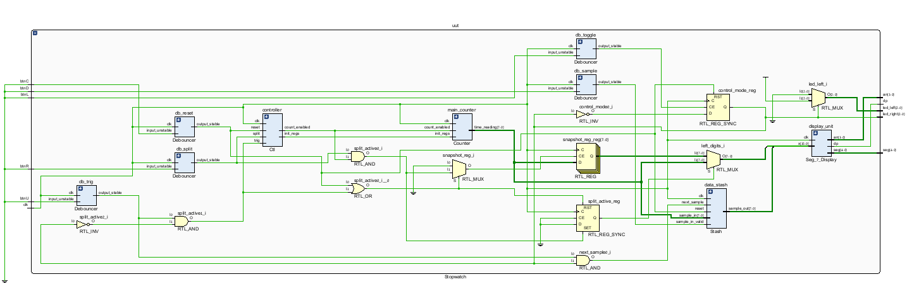
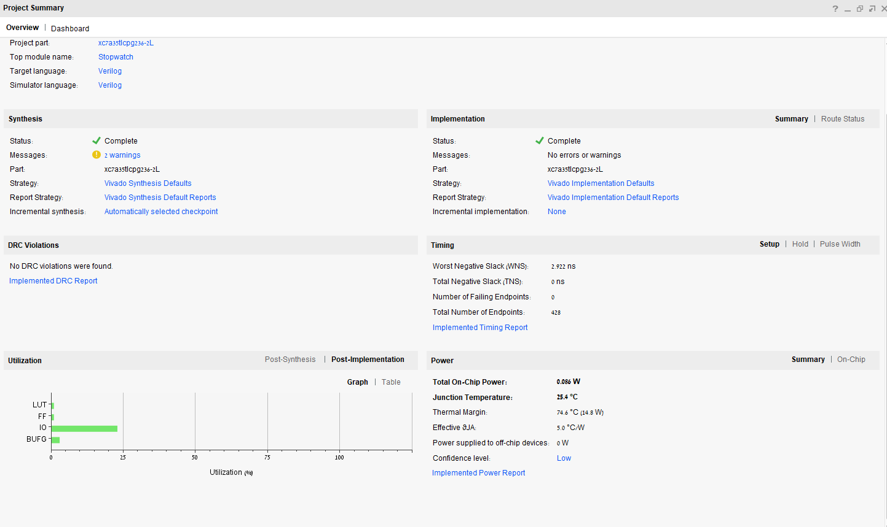
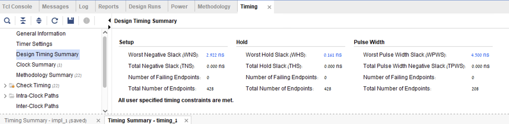
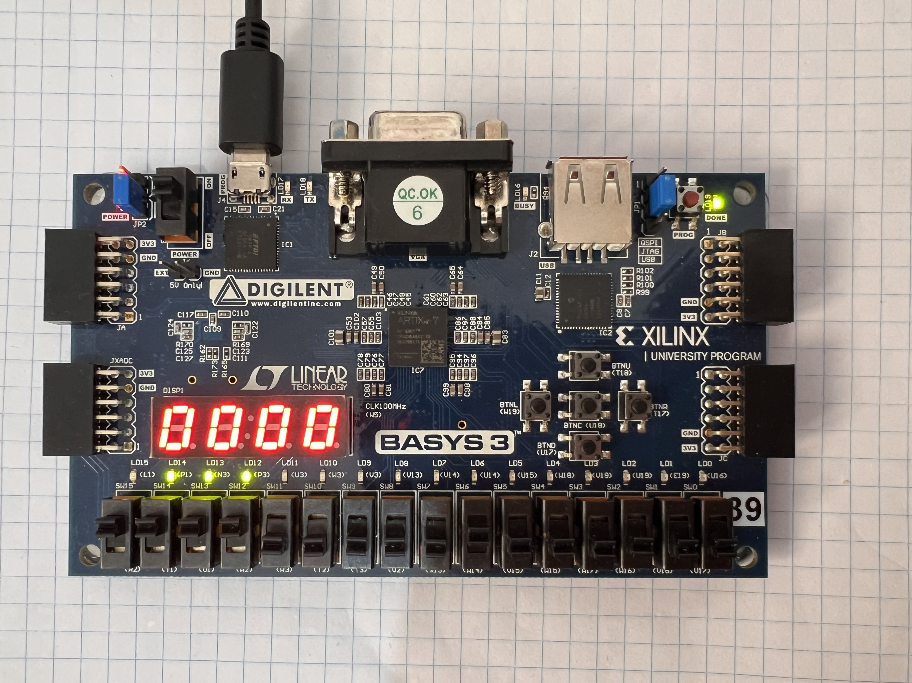
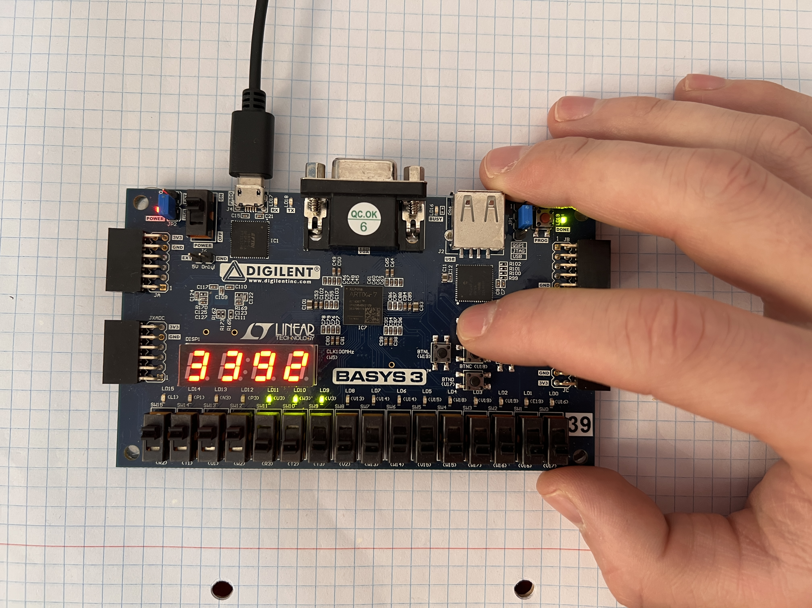
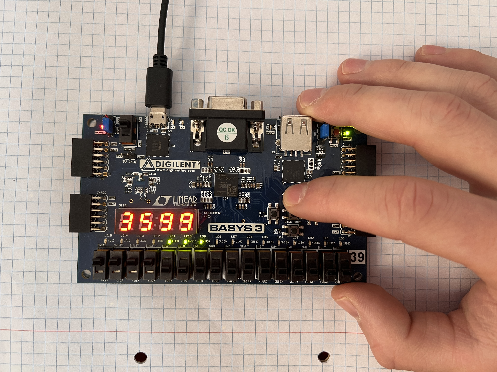
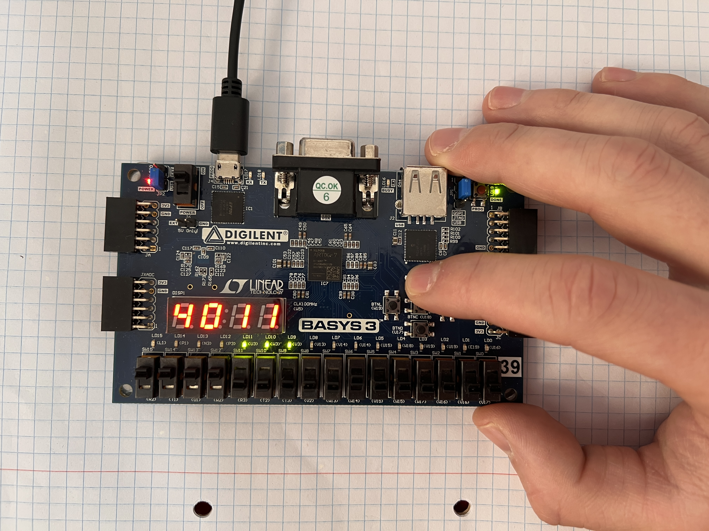

# FPGA-Based Digital Stopwatch with Memory Stash ⏱️

## Overview
A fully functional digital stopwatch system designed from the gate level up to a complete system-on-chip (SoC) architecture, implemented on a **Xilinx Artix-7 (Basys 3) FPGA**. 

This project goes beyond simple counting, featuring a robust Finite State Machine (FSM) for control, hardware-level button debouncing, custom adder architectures (Conditional Sum Adder), and an integrated memory "Stash" to capture and navigate through lap times.

## 🌟 Key Features
* **Custom Digital Logic:** Implemented using base gates to build Full Adders (FA) and Conditional Sum Adders (CSA) for optimized O(log N) propagation delay.
* **Frequency Division & Timing:** Scaled the 100MHz master clock down to 1Hz and 0.1Hz using parameterized 'Limited Incrementor' modules for precise BCD counting up to 99 seconds.
* **Data Stash Memory:** A synchronous memory module capable of storing up to 5 time samples (DEPTH=5). Features circular Read/Write pointer logic with immediate visibility of new samples via MUX overriding.
* **Robust Hardware Debouncing:** Designed a 16-bit saturating up/down counter acting as a digital low-pass filter (0.65ms latency) to eliminate mechanical bounce from physical buttons.
* **Time-Division Multiplexing (TDM) Display:** Engineered a 7-segment display driver refreshing at 381Hz to drive 4 digits seamlessly using only 12 I/O pins, preventing visual flicker using persistence of vision.
* **Timing Closure:** Successfully met all rigorous timing constraints at 100MHz with a Worst Negative Slack (WNS) of 2.922 ns.

---
## 🏗️ System Architecture 

The system is orchestrated by a Top Module integrating the following components:
1. **Inputs Processing:** Five physical buttons routed through dedicated Debouncers and Edge Detectors.
2. **Control Unit (FSM):** A Mealy state machine managing transitions.
3. **Data Path:** A synchronous BCD counter feeding both the live display and the Data Stash memory.
4. **Display Driver:** Evaluates current FSM state to multiplex between live counting and stashed memory.

### Control Logic & State Machine
The core control unit was designed using a robust Finite State Machine (FSM) to manage user inputs and system states (Counting, Paused, Split). 

*Below is the initial hand-drawn blueprint mapping the FSM state transitions and hardware control logic:*

### RTL & Synthesis Schematics
Below are the elaborated RTL schematic and the post-synthesis physical mapping generated via Vivado:

**Elaborated RTL Schematic:**

**Synthesized Design:**

---

## 📊 Implementation & Timing Results
To ensure robust performance, the design was fully synthesized, implemented, and optimized for the Artix-7 FPGA. 

**Project Summary & Resource Utilization:**
The design is highly efficient, utilizing less than 2% of the available LUTs and Flip-Flops.

**Static Timing Analysis (STA):**
The design successfully met all rigorous timing constraints for a 100MHz master clock, achieving a positive Worst Negative Slack (WNS) of 2.922 ns.

---

## 📷 Hardware Demonstration

Here is the system running on the Digilent Basys 3 board:

---
### 🎥 Video Demo
[Click here to watch the full hardware demonstration](https://youtu.be/A6s4nlWiTE4)
---
## 📄 Full Project Documentation
For an in-depth technical breakdown of the architecture, module-level explanations, and complete simulation waveforms, please refer to the full project report:

[📄 View / Download the Full Project Report](FPGA_Stopwatch_Full_Report.pdf)

---
## 🛠️ Tools & Technologies
* **Language:** Verilog (RTL Design & Testbenches)
* **EDA Tool:** Xilinx Vivado
* **Hardware:** Digilent Basys 3 (Artix-7 FPGA: xc7a35tcpg236-2L)
* **Validation:** Extensive behavioral simulation using self-checking testbenches and waveform analysis for functional verification.

---
*Project developed in collaboration with Rotem Vasa*.
